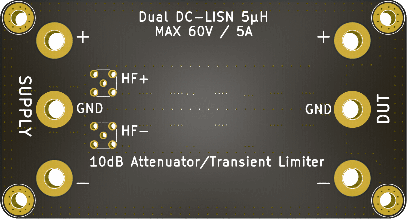
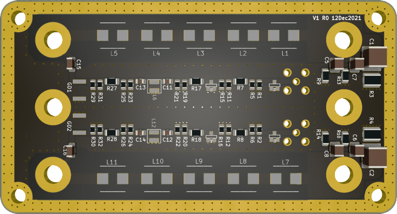

# 5µH LISN(Line Impedance Stabilization Network)
Open Source Hardware Dual 5µH DC LISN with 10dB Attenuator and Transient Limiter for Spectrum Analyzer EMC work.

A LISN is a [Line Impedance Stabilization Network](https://en.wikipedia.org/wiki/Line_Impedance_Stabilization_Network) used in conducted emissions testing.

The AIM of this Dual LISN is to be used for EMC pre-testing with frequency range 30kHz(or lower) to 110MHz(or up to 150MHz or more).

This open source hardware LISN V1 R0 include following features:
* Designed with fully open source tools like [KiCad 5.99 Nightly](https://www.kicad.org)
* Improvement in this design: 
  * Added simulation with LTSpice of the 10dB Attenuator / Transient Filter (with default 1N4148 and BAV99 see Simu dir)
  * Modified Supply & DUT "+ GND -" to be separated by 19.06mm for 4mm BANANA JACK for BNC adapter
  * Use BAV99 instead of 1N4148W Diodes (improve 10dB Attenuator and Transient Limiter to be flat up to >200MHz)
  * Replace Keystone 575-4 by Keystone 575-8 (as the 575-4 was too short)
  * Added more via for better thermal transfer/decoupling around capacitors ...

* Dual LISN in one aluminum box(Hammond 1590B)
  * Maximum current: 5A
  * Nominal operating voltage range: 0V to 60V DC
  * Include 10dB Attenuator and Transient Limiter for each SMA connector to be connected to a Spectrum Analyzer
    * Max. 1W / 30dBm if 50°C Temperature raise is allowed
    * The Transient limiter is a 9kHz HP filter, which is also a dc block.

This work is heavily based on work from others mainly **Jay_Diddy_B** & **Noy** from EEVBLOG forum.

See all links related to the original Dual 5µH LISN:
* https://www.eevblog.com/forum/projects/5uh-lisn-for-spectrum-analyzer-emcemi-work/75/
* https://www.eevblog.com/forum/projects/5uh-lisn-for-spectrum-analyzer-emcemi-work/msg3420102/#msg3420102

Video related to EMC Conducted Emissions / LISN:
* Rohde Schwarz video Understanding LISNs: 
  * This video explains the design and function of a LISN (line impedance stabilization network) and how LISNs are used in conducted EMC testing.
  * https://www.youtube.com/watch?v=QPJzp66Yvzs
* EMC Conducted Emissions: How to connect and set up a LISN:
  * In this video Dr. Ali Shirsavar shows how you can connect and set up a LISN ready for pre-compliance testing of EMC conducted emissions.
  * https://www.youtube.com/watch?v=28oDdL9RnWM
